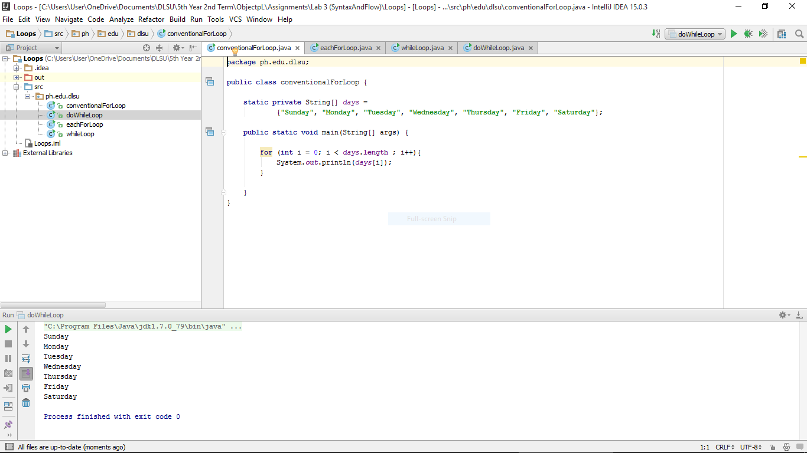
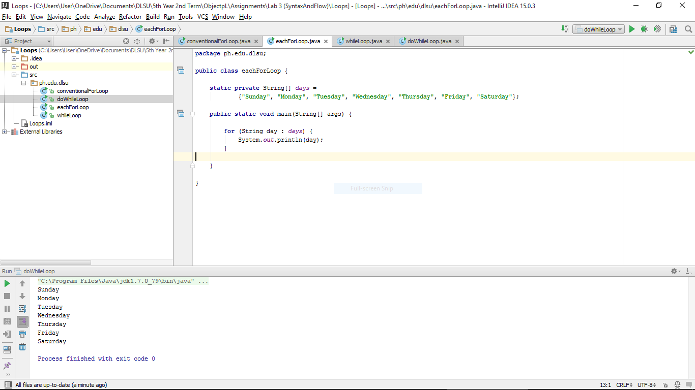
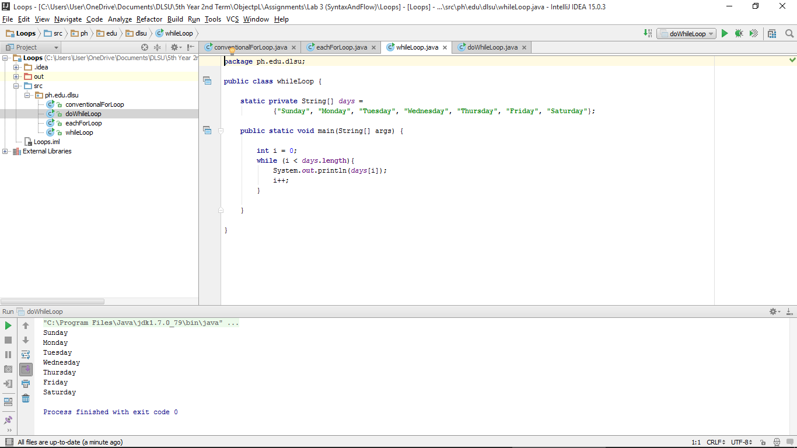
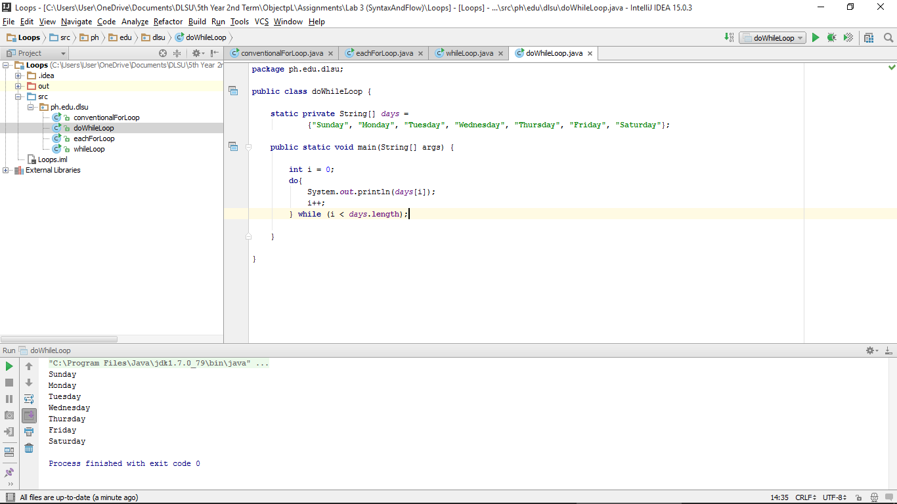

#Loops

Conventional and Each For-Loop, While Loop, Do-While Loop

#ScreenShots

Conventional For-Loop:

Each For-Loop:

While Loop:

Do-While Loop:

#Codes

###ConventionalForLoop
~~~
package ph.edu.dlsu;

public class conventionalForLoop {

    static private String[] days =
            {"Sunday", "Monday", "Tuesday", "Wednesday", "Thursday", "Friday", "Saturday"};

    public static void main(String[] args) {

        for (int i = 0; i < days.length ; i++){
            System.out.println(days[i]);
        }

    }
}
~~~

###EachForLoop
~~~
package ph.edu.dlsu;

public class eachForLoop {

    static private String[] days =
            {"Sunday", "Monday", "Tuesday", "Wednesday", "Thursday", "Friday", "Saturday"};

    public static void main(String[] args) {

        for (String day : days) {
            System.out.println(day);
        }

    }

}
~~~

###WhileLoop
~~~
package ph.edu.dlsu;

public class whileLoop {

    static private String[] days =
            {"Sunday", "Monday", "Tuesday", "Wednesday", "Thursday", "Friday", "Saturday"};

    public static void main(String[] args) {

        int i = 0;
        while (i < days.length){
            System.out.println(days[i]);
            i++;
        }

    }

}
~~~

###DoWhileLoop
~~~
package ph.edu.dlsu;

public class doWhileLoop {

    static private String[] days =
            {"Sunday", "Monday", "Tuesday", "Wednesday", "Thursday", "Friday", "Saturday"};

    public static void main(String[] args) {

        int i = 0;
        do{
            System.out.println(days[i]);
            i++;
        } while (i < days.length);

    }

}
~~~
